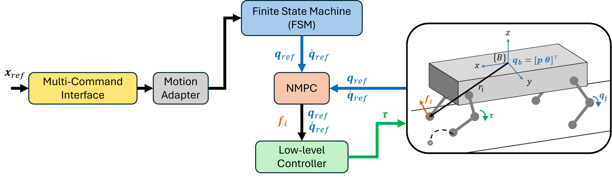

# legged_planner
<p align="center">
  
</p>


## Overview
The package `legged_planner` makes use of the [OCS2 repository](https://github.com/leggedrobotics/ocs2) to transform any high level motion commands(e.g. planners from single integrator, double integrator, rigid body model, etc. or in general high velocity commands)  into a quadrupedal motion trajectory.
This package differs from others in the sense that it allows for high fidelity motion planning for quadrupeds (and not simply velocity control) with extreme ease. 

<p align="center">
  
</p>

The `legged_planner` architecture of the algorithm consist of two core components:
1. **Multi Command Interface**: Abstract class that handles logistics in interfacing with varying command interface (e.g. velocity command, target pose, or motion planning trajectories). This increases the ease of utilizing different commands for quadrupeds
2. **Motion Adapter**: A filtering layer that transforms these motion trajectories into trajectories appropriate for a legged robot.

Briefly summarizing the rest of the diagram (which are components in OCS2):
- The finite state machine (FSM), handles generation of the discontinuous dynamics due to contact with the terrain
- Accounting for disontinuous dynamics, NMPC generates locally optimal solution while adhering to dynamic constraints
- These are then tracked through a low-level torque control

## Getting Started
This framework relies on the OCS2 repository, so the following dependencies needs to be installed. **NOTE**: OCS2 is a large repository, and so this repository will only build packages pertaining to legged robots. This package assumes the user is using Linux Distro Ubuntu 20.04 (Focal Fossa) and has set up/installed the ros-distro (ros noetic). If ROS Noetic not installed, see how to install [ROS Noetic](http://wiki.ros.org/noetic/Installation/Ubuntu).

### Create catkin workspace
```
mkdir -p ~/<catkin_ws_name>/src
```

### Clone source code ###
```
# Go to src directory
cd ~/<catkin_ws_name>/src
# clone the repository
git clone git@github.com:AndrewZheng-1011/legged_planner.git # # If have not setup ssh key, use the web url: https://github.com/AndrewZheng-1011/legged_planner.git
```

### Clone OCS2 & Dependencies ###
```
git clone git@github.com:leggedrobotics/ocs2.git # If have not setup ssh key, use the web url: https://github.com/leggedrobotics/ocs2.git
git clone --recurse-submodules https://github.com/leggedrobotics/pinocchio.git
git clone --recurse-submodules https://github.com/leggedrobotics/hpp-fcl.git
git clone https://github.com/leggedrobotics/ocs2_robotic_assets.git
```

### Install Other Dependencies ###
```
sudo apt install liburdfdom-dev liboctomap-dev libassimp-dev
# Python dependencies
pip3 install sympy # Symbolic python package
pip3 install numpy # Numpy
# ROS Dependencies for catkin tools
sudo apt-get install ros-$ROS_DISTRO-catkin python3-catkin-tools -y
sudo apt-get install ros-$ROS_DISTRO-grid-map
# Eigen library
sudo apt-get install libeigen3-dev
# Doxygen
sudo apt-get install doxygen doxygen-doc doxygen-gui graphviz
```

### Setup workspace & Build ###
Configure the workspace with debug info
```
cd ~/<catkin_ws_name>
catkin config -DCMAKE_BUILD_TYPE=RelWithDebInfo
catkin config --extend /opt/ros/noetic # Extend only to default ros
```

Build ocs2 packages
```
catkin build ocs2_legged_robot_ros ocs2_self_collision_visualization
```

Install python dependencies
```
sh ~/<catkin_ws_name>/src/legged_planner/legged_body_planner/setup_deps.sh
```

Make python script files executable
```
chmod+x ~/<catkin_ws_name>/src/legged_planner/legged_body_planner/src/scripts/pub_body_plan_demo.py
chmod+x ~/<catkin_ws_name>/src/legged_planner/legged_body_planner/src/scripts/traj_pub_demo.py
```

Build the source code of `legged_body_planner` and source it
```
catkin build legged_body_planner legged_body_msgs
source ~/<catkin_ws_name>/devel/setup.bash
```

## Run Package:

### Basic
1. Initialize simulation
```
roslaunch ocs2_legged_robot_ros legged_robot_sqp.launch
```

2. Run one of the 'walking' gait sequences before running next launch file (e.g. trot)
3. Initialize plan node
```
roslaunch legged_body_planner legged_body_plan.launch
```

## Personalize Motion Command Interface
### Generic motion planning
It is very intuitive to run this command interface framework with a generic planning algorithms. Simply publish a plan in the form of a `Plan` msg, and the legged body planner node will handle the rest. See demo files in the `legged_body_planner/src/scripts/pub_body_plan_demo.py` for a python example. Then change the plan node in the `legged_body_plan.launch` file.

Example of the fidelity of planning that can be controlled can be seen as well.

<p align="center">
  
</p>

### Develop own motion command interface
By utilizing an abstract class for motion adaptation (e.g. `/legged_body_planner/include/legged_body_planner/motion_adapters/MotionAdapter.h`), it is simple to then integrate the your own motion command interface. See the source files for examples. 

## TODO
### General
1. Change code s.t. modularize reliance on OCS2
2. Add architectural change s.t. compatible with either a server or subcriber/publisher framework
3. Add asynchronous threading s.t. different motion command interfaces can operate at different frequencies
